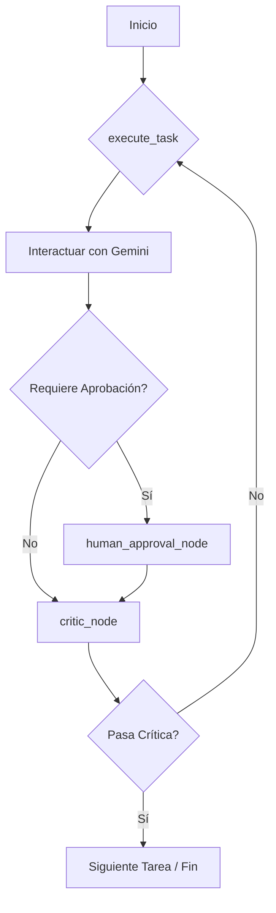

# Arquitectura del Sistema

El Gemini Web Agent está diseñado como un puente entre clientes MCP y la interfaz web de Gemini, utilizando una arquitectura desacoplada para mayor robustez y mantenibilidad.

## 🏗️ Componentes Principales

### 1. Servidor MCP (`src/mcp_server.py`)
- **Responsabilidad**: Punto de entrada para comandos MCP y peticiones HTTP.
- **Tecnología**: FastMCP (Starlette).
- **Funcionalidad**: Define las herramientas disponibles, valida los esquemas de entrada/salida y gestiona el ciclo de vida del navegador.

### 2. Controlador de Acciones (`src/mcp_controller/`)
- **`actions.py`**: Implementa el patrón *Page Object Model* (POM). Contiene la lógica pura de interacción (hacer clic, escribir, validar estados) abstrayendo la complejidad de Playwright.
- **`selectors.py`**: Gestiona la carga y uso de selectores CSS. Soporta un sistema de *fallbacks* (selectores alternativos) para mitigar cambios en la UI de Gemini.

### 3. Orquestador y Estado (`src/orchestrator/`)
- **`graph.py`**: Implementa el motor de decisión usando **LangGraph**. Define un grafo de estados que permite:
    - **Ciclos de Crítica**: Un nodo "critic" puede rechazar una respuesta si es demasiado corta o parece errónea, forzando un reintento.
    - **Aprobación Humana**: Soporta pausar la ejecución en tareas sensibles (como Deep Research) para esperar una confirmación externa.
- **`state.py`**: Define el esquema de datos que fluye entre los nodos del grafo, permitiendo persistir el contexto de la tarea actual.

### 4. Capas de Utilidad (`src/utils/`)
- **`screenshot_manager.py`**: Captura automática de evidencia visual en fallos o éxitos.
- **`state_validator.py`**: Verifica que la UI esté en el estado esperado después de una acción (ej. "¿se envió realmente el prompt?").
- **`retry_handler.py`**: Lógica de reintentos exponenciales para acciones propensas a fallos de red o de carga.

## 🔄 Flujo de Datos y Orquestación

## 🔐 Gestión de Sesión
El sistema utiliza perfiles persistentes de Chromium ubicados en `profiles/default`. Esto permite que las cookies de autenticación, la configuración de idioma y el estado local se mantengan entre reinicios del servidor, evitando bloqueos por inicios de sesión frecuentes.
