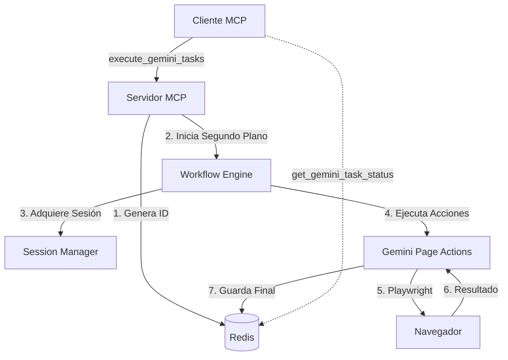

# Arquitectura del Sistema

El Gemini Web Agent está diseñado como un puente entre clientes MCP y la interfaz web de Gemini, utilizando una arquitectura desacoplada para mayor robustez y mantenibilidad.

## 🏗️ Ciclo de Vida de una Tarea

El sistema utiliza un modelo asíncrono basado en Redis para manejar tareas de larga duración (como Deep Research).

## 🧩 Componentes Principales

### 1. Servidor MCP (`src/mcp_server.py`)
- **Responsabilidad**: Punto de entrada para comandos MCP y peticiones HTTP.
- **Tecnología**: FastMCP (Starlette).
- **Asincronía**: Implementa una arquitectura de "produce-consume" donde las tareas se delegan a un hilo secundario inmediatamente, retornando un `request_id` para polling.

### 2. Controlador de Acciones (`src/mcp_controller/`)
- **`actions.py`**: Implementa el patrón *Page Object Model* (POM). Contiene la lógica pura de interacción.
- **Estrategia de Interacción**: Para prompts largos, el agente utiliza `evaluate` de JavaScript para insertar el texto directamente en el DOM, evitando la latencia y posibles timeouts del tecleo carácter por carácter.
- **`selectors.py`**: Gestiona la carga y uso de selectores CSS con soporte de *fallbacks*.

### 3. Orquestador y Estado (`src/orchestrator/`)
- **Workflow**: Aunque existe una implementación con **LangGraph** para lógicas complejas de crítica, el flujo actual se centra en una ejecución secuencial robusta que detecta automáticamente herramientas especiales (Canvas, Deep Research).
- **Confirmación Automática**: El orquestador maneja la espera y confirmación de planes en Deep Research sin intervención del usuario.

## 💾 Persistencia y Estado
- **Redis**: Actúa como la fuente de verdad para el estado de las tareas. Almacena objetos `TaskResponse` con estados: `processing`, `success`, `error`.
- **Perfiles de Navegador**: Ubicados en `profiles/default`, mantienen el estado de autenticación y cookies para evitar logins manuales recurrentes.

## 🔐 Gestión de Sesión
El sistema utiliza perfiles persistentes de Chromium ubicados en `profiles/default`. Esto permite que las cookies de autenticación, la configuración de idioma y el estado local se mantengan entre reinicios del servidor, evitando bloqueos por inicios de sesión frecuentes.
